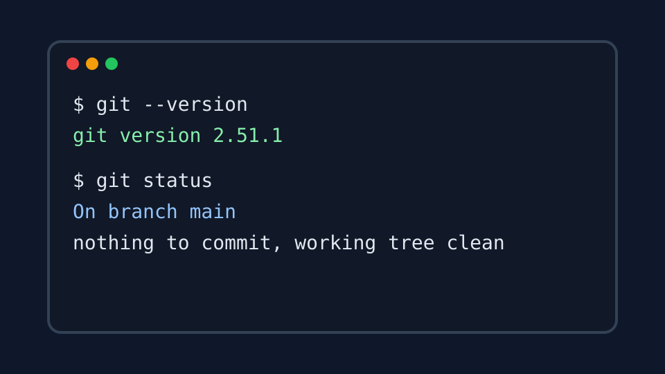

# Guía técnica de instalación de Git en macOS

## 1. Introducción

Git es un sistema de control de versiones que registra los cambios de un proyecto y facilita el trabajo colaborativo.

## 2. Requisitos previos

- Una Mac con acceso a Internet.
- Una cuenta de usuario con permisos para instalar herramientas.
- La aplicación Terminal.

## 3. Instalación

### 3.1 Comprobar si Git ya está instalado

Abra Terminal y ejecute:

```bash
git --version
```

Si aparece un número de versión, Git ya está instalado.

### 3.2 Instalar con las herramientas de Apple

Ejecute:

```bash
xcode-select --install
```

Confirme la instalación en la ventana de macOS y espere a que finalice.

### 3.3 Configurar la identidad

```bash
git config --global user.name "Caleb Aliaga"
git config --global user.email "correo@example.com"
```

Reemplace el correo de ejemplo por el correo asociado a GitHub.

## 4. Verificación

```bash
git --version
git config --global --list
```

La salida debe mostrar la versión de Git, el nombre y el correo configurados.

## 5. Problemas frecuentes

- **Comando no encontrado:** cierre y vuelva a abrir Terminal.
- **Nombre o correo incorrectos:** ejecute nuevamente los comandos de configuración.
- **Falla de descarga:** compruebe la conexión a Internet y repita la instalación.

## 6. Recursos

- [Descargas de Git](https://git-scm.com/downloads)
- [Documentación oficial](https://git-scm.com/doc)


