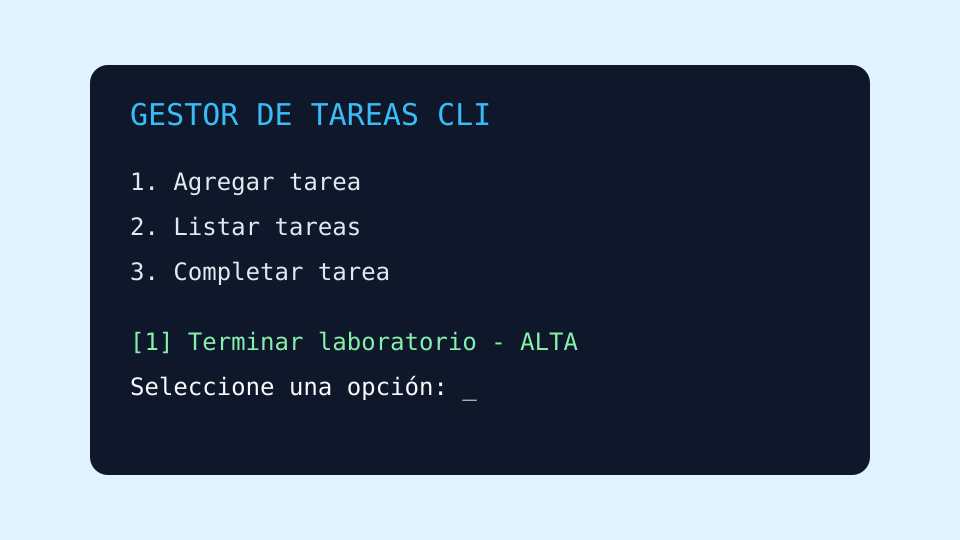

# Gestor de Tareas CLI

## 1. Descripción

Gestor de Tareas CLI es una pequeña aplicación de consola que permite registrar y consultar tareas personales.

### 1.1 Objetivo

Facilitar la organización diaria mediante una interfaz simple ejecutada desde la terminal.

## 2. Funcionalidades

- Registrar una tarea con título y prioridad.
- Mostrar todas las tareas guardadas.
- Marcar tareas como completadas.
- Eliminar tareas que ya no sean necesarias.

## 3. Tecnologías utilizadas

- Python 3.
- Archivos JSON para almacenamiento local.
- Git para control de versiones.
- Markdown para documentación.

## 4. Ejecución del proyecto

### 4.1 Pasos de ejecución

1. Instalar [Python](https://www.python.org/downloads/).
2. Descargar o clonar el proyecto.
3. Abrir una terminal en la carpeta del proyecto.
4. Ejecutar el programa:

```bash
python3 app.py
```

## 5. Ejemplo de código

```python
def agregar_tarea(tareas, titulo, prioridad):
    tarea = {"titulo": titulo, "prioridad": prioridad, "completada": False}
    tareas.append(tarea)
    return tarea
```

Ejemplo del archivo de datos:

```json
{
  "titulo": "Terminar laboratorio",
  "prioridad": "alta",
  "completada": false
}
```

## 6. Recursos

- [Documentación de Python](https://docs.python.org/es/3/)
- [Documentación del módulo JSON](https://docs.python.org/es/3/library/json.html)


