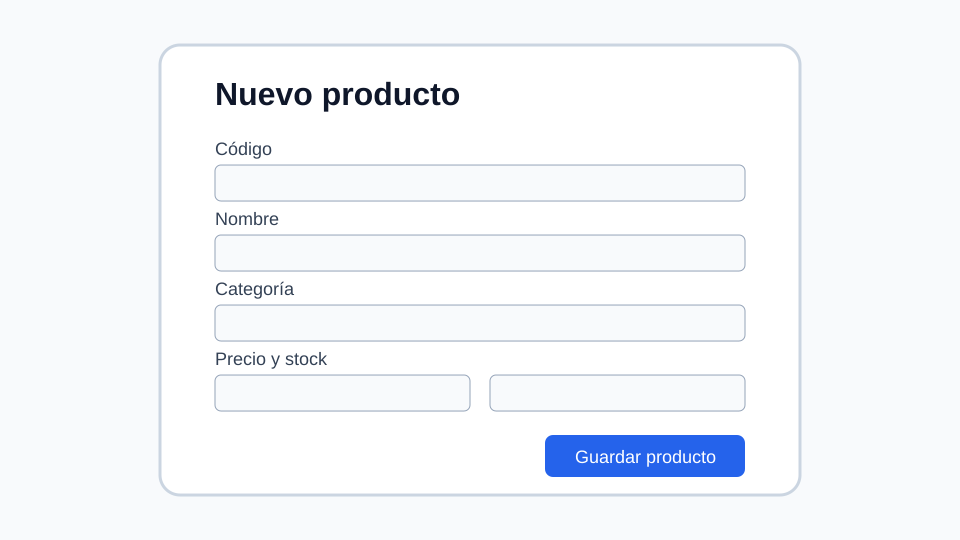
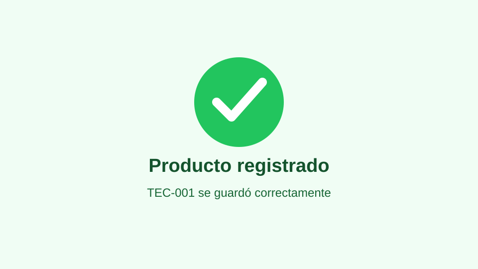

# Guía de usuario para registrar un producto

## 1. Objetivo

Esta guía explica cómo registrar un producto nuevo en el sistema ficticio Inventario Fácil.

### 1.1 ¿Qué permite realizar esta funcionalidad?

Permite almacenar la información necesaria para controlar existencias, precios y categorías de productos.

## 2. Información necesaria

- Código único del producto.
- Nombre del producto.
- Categoría.
- Precio unitario.
- Cantidad inicial.

## 3. Procedimiento

### 3.1 Paso 1

Ingrese al menú **Productos** y seleccione **Nuevo producto**.



### 3.2 Paso 2

Complete todos los campos obligatorios. Por ejemplo:

```json
{
  "codigo": "TEC-001",
  "nombre": "Teclado mecánico",
  "categoria": "Periféricos",
  "precio": 149.90,
  "stock": 12
}
```

### 3.3 Paso 3

Revise los datos y pulse **Guardar producto**.

## 4. Resultado esperado

El sistema debe mostrar una confirmación y el producto debe aparecer en el listado.



## 5. Errores frecuentes

- Utilizar un código que ya pertenece a otro producto.
- Dejar campos obligatorios vacíos.
- Escribir texto en los campos de precio o cantidad.
- Registrar un precio o stock negativo.

## 6. Ayuda adicional

- [Principios de diseño de formularios](https://developer.mozilla.org/es/docs/Learn_web_development/Extensions/Forms)
- [Validación de formularios web](https://developer.mozilla.org/es/docs/Learn_web_development/Extensions/Forms/Form_validation)
